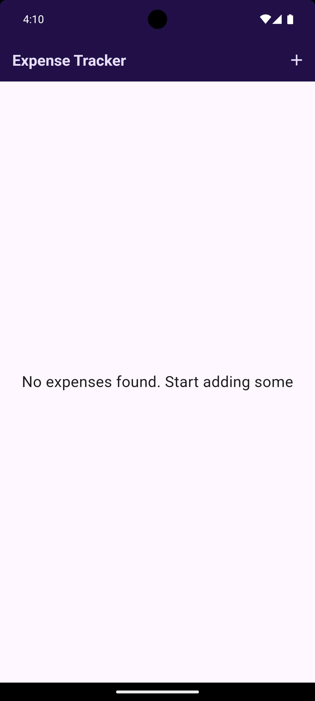
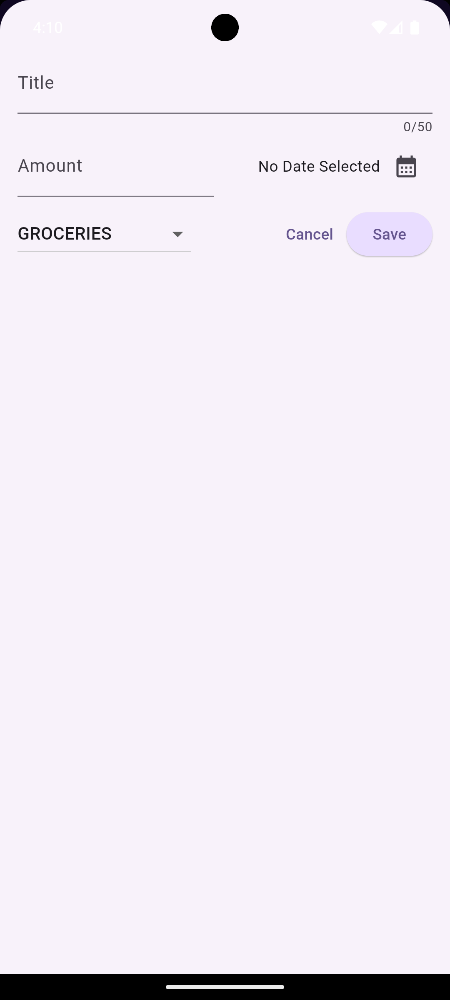
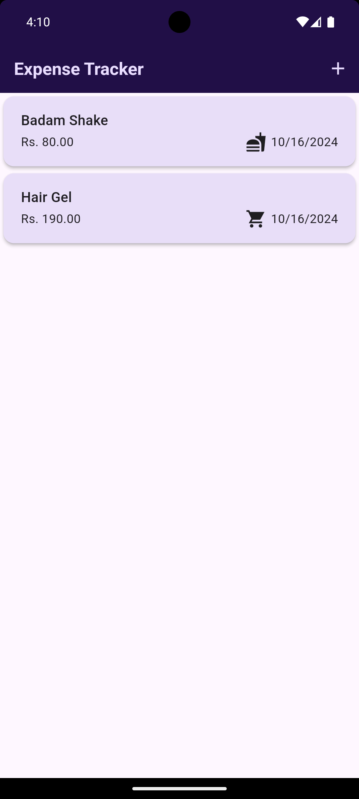

# Expense Tracker App

A Flutter-based mobile application to help you track your daily expenses efficiently.

## Features

- Add new expenses with title, amount, date, and category.
- View a list of all expenses in a card layout.
- Light and Dark mode support.
- Simple and intuitive UI.

## Screenshots

### Home Screen



### Add Expense Screen



### Expense List Screen



## Getting Started

Follow the steps below to set up the project on your local machine.

### Prerequisites

- Flutter SDK installed: [Flutter Installation Guide](https://flutter.dev/docs/get-started/install)
- A code editor like Visual Studio Code or Android Studio.

### Installation

1. Clone the repository:
   ```bash
   git clone https://github.com/yourusername/expense-tracker.git
   cd expense-tracker
   ```
2. Install the required dependencies:
   ```bash
   flutter pub get uuid
   flutter pub get intl
   ```
3. Run the app on an emulator or physical device:
   ```bash
   flutter run
   ```

## How to Use

1. Add an expense by providing a title, amount, date, and selecting a category.
2. View the list of added expenses.
3. Use the dark mode toggle to switch between light and dark themes.

## Download

[Download the APK](https://github.com/yourusername/expense-tracker/releases)

## Contributing

Pull requests are welcome! For significant changes, please open an issue to discuss what you would like to change.
